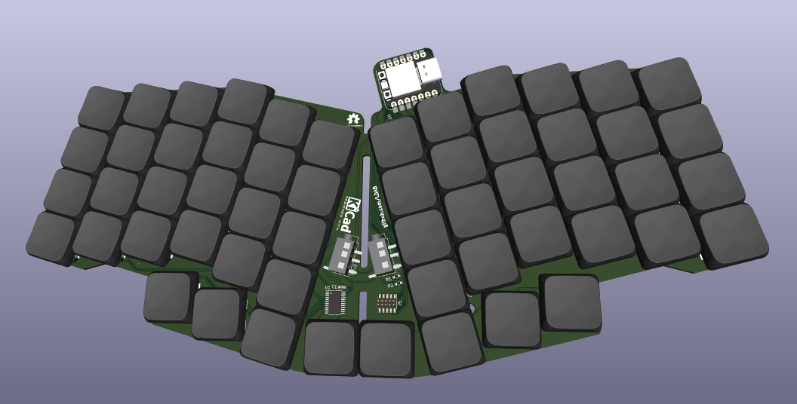

# split-or-not-keyboard

FoMO ZMK Ortholinear keyboard, if you can't decide between split or not.

  

## Todo

## Note

- Polling mode add extra 60uA
-

## Why?

Maybe you are here because you are considering a ZMK keyboard and you don't know if you are ready for a split keyboard? Or you don't know if you prefer a rectangular or "ergo" design? Or you have fear or missing out and want to try all of them but don't want to spend all your money?

## How?

## Designed with KiCAD 7.09

- Important libs are added as plugin as per described on https://github.com/ebastler/marbastlib

## BOM

* 1x Seeed Studio XIAO nRF52840
* 1x PCA9555 GPIO Expander
* 60x 1N4148W diodes
* 60x Kailh choc switches
* 60x Kailh choc keycap
* 60x Kailh choc Hotswap Sockets

## Variants

### Basic60

  

  

### Ergo56

  

  

## Battery life

## Outro

- Some similarities with below may be found:
  - https://github.com/piit79/rev57lp/
